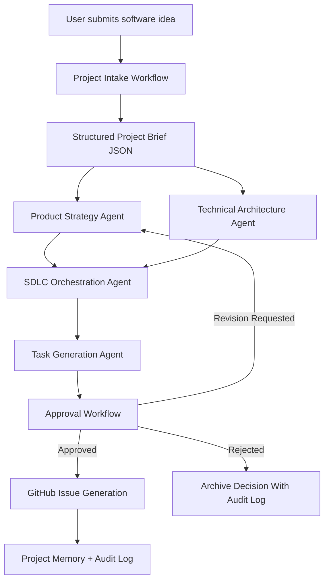
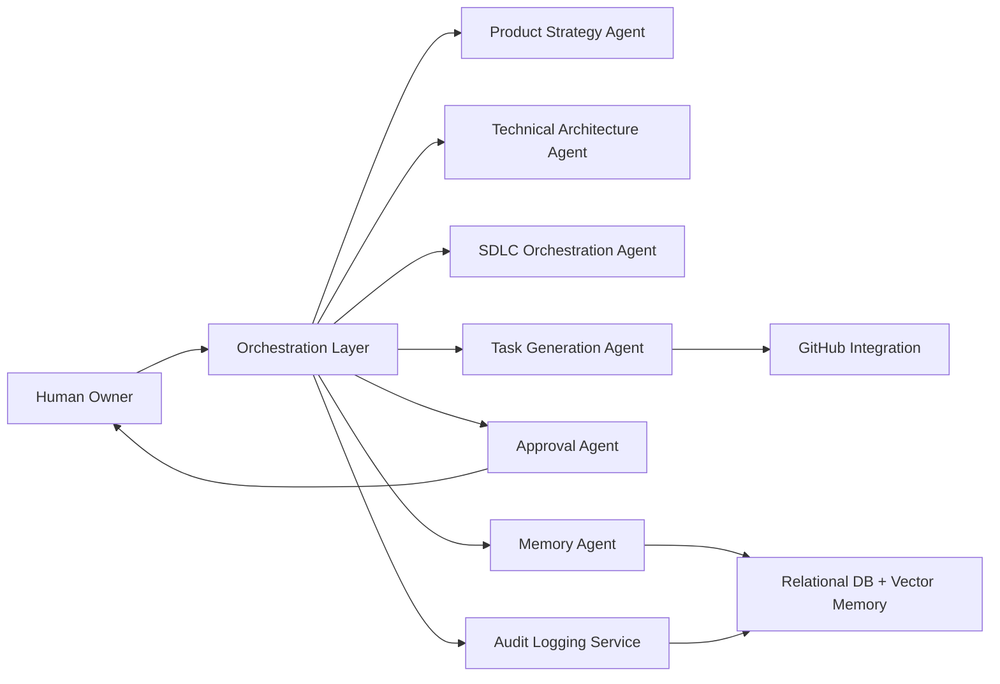
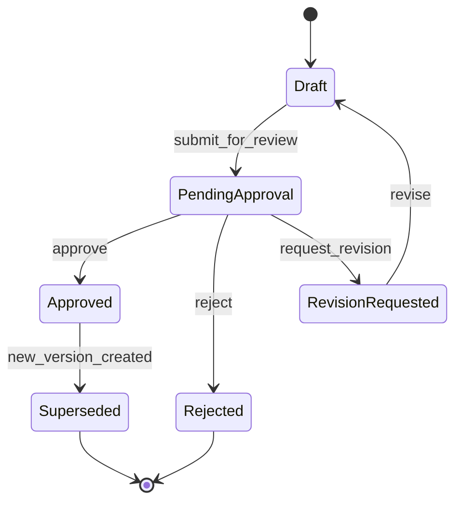
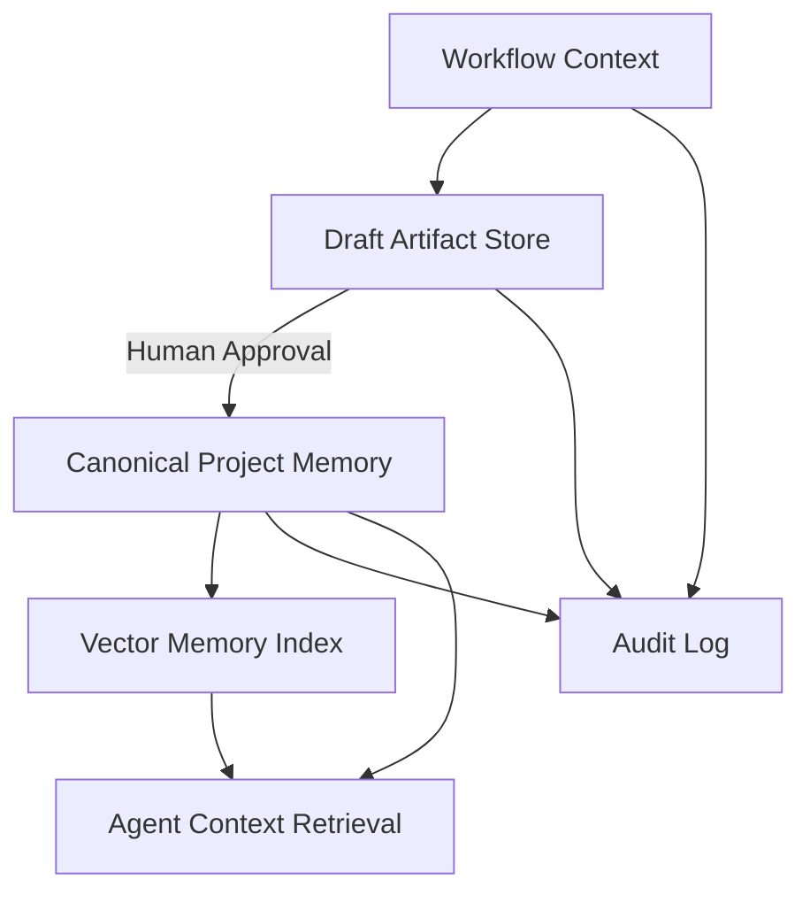
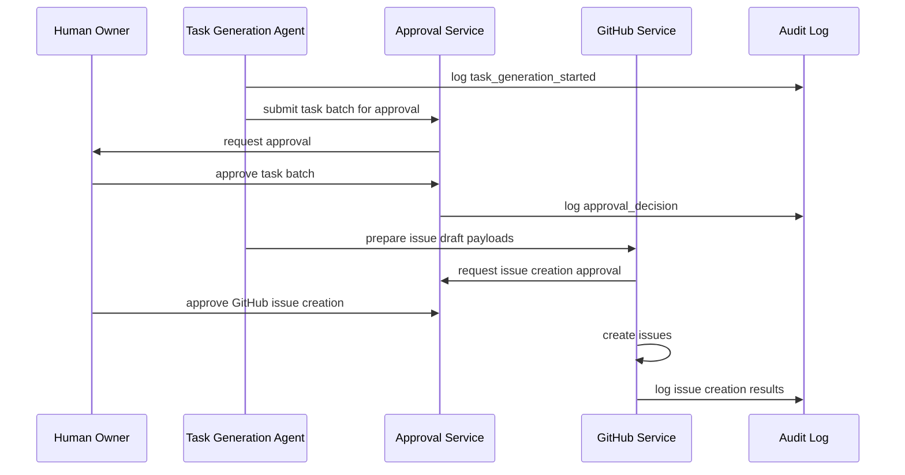
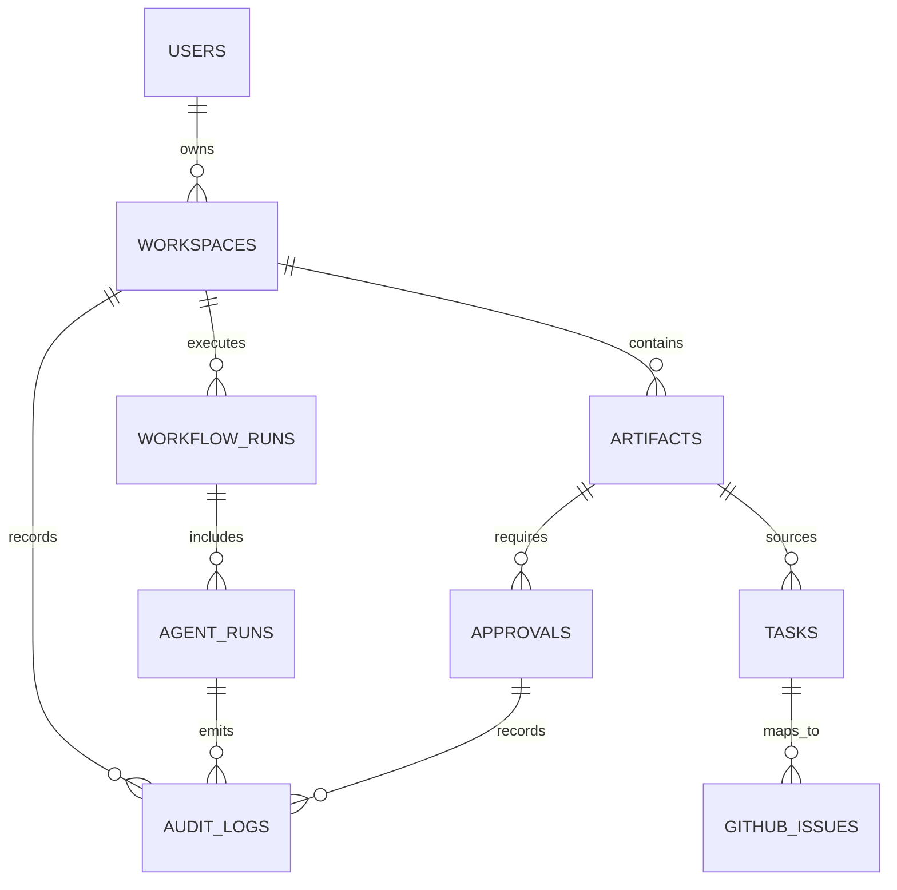

# Revealth v0.1 Product Requirements Document

## Executive Summary

Revealth is an autonomous AI software company operating system.

Revealth transforms a founder's software idea into structured software company work: product planning, SDLC orchestration, task decomposition, approval routing, documentation, and eventually execution. The v0.1 MVP focuses strictly on autonomous project planning and SDLC task generation. It does not autonomously deploy software, execute production code changes, run billing workflows, or communicate with customers without explicit human approval.

The core thesis is that founders and business owners do not only need a coding assistant. They need an operating system that can behave like a disciplined software company: collecting requirements, decomposing work, creating traceable tasks, enforcing approvals, preserving institutional memory, and producing auditable business and engineering outputs.

Revealth v0.1 will prove the foundation of that system by converting a user's product idea into:

- A structured project brief
- Product requirements
- Architecture assumptions
- SDLC phases
- Agent-generated work breakdowns
- GitHub-ready issues with acceptance criteria
- Approval-gated planning artifacts
- Audit logs for every material agent action
- Structured JSON outputs for every workflow step

## Mission

Revealth exists to give founders, investors, and business owners an autonomous AI software company operating system that can plan, coordinate, and eventually build software products with the discipline, memory, governance, and reliability of a real software organization.

## Problem Statement

Software creation remains bottlenecked by organizational coordination, not only by code generation. Early-stage founders often have ideas but lack the structure needed to convert those ideas into executable software delivery plans. Existing AI tools can generate code, documents, or chat responses, but they generally fail to provide:

- Durable project memory
- Structured decision records
- Approval-aware task generation
- Traceable SDLC orchestration
- GitHub issue discipline
- Acceptance criteria for every task
- Audit logs for agent actions
- Clear boundaries between planning, execution, deployment, and monetization

Without these controls, AI-generated software work becomes difficult to trust, govern, or scale. Revealth addresses this gap by treating AI agents as accountable software company departments rather than free-form chat personalities.

## Vision

Revealth will become the operating system through which a software idea moves from concept to market:

1. A human owner submits an idea, business goal, or product thesis.
2. AI departments analyze the idea, identify risks, and produce planning artifacts.
3. The human approves, revises, or rejects major decisions.
4. Revealth generates SDLC plans, GitHub issues, acceptance criteria, and audit logs.
5. Later versions coordinate implementation, testing, deployment, monitoring, maintenance, and monetization.

The long-term product should feel less like a chatbot and more like a governed software company console: structured, accountable, measurable, and always under owner authority.

## Operational Philosophy

### Reliability Over Hype

Revealth optimizes for dependable, reviewable outputs before autonomous action. Agent autonomy must expand only when system reliability, user trust, and audit coverage are sufficient.

### Measurable Outputs Over Simulated Intelligence

Agents are evaluated by the quality of artifacts they produce: requirements, task plans, acceptance criteria, risk registers, decisions, and GitHub issues. The product must not reward theatrical behavior, vague confidence, or simulated company roleplay.

### Human Oversight Before Full Autonomy

The human owner is the approval authority. v0.1 requires approval before finalizing project plans, generating GitHub issues, or advancing SDLC stages. Future execution workflows must inherit the same governance model.

### Auditability For Every Action

Every agent action must be logged with inputs, outputs, model metadata, decision rationale, timestamp, status, and approval linkage. Revealth must be able to answer: who or what did this, why, with what context, and under which approval?

### Modular Multi-Agent Orchestration

Agents should be modular, inspectable, and replaceable. Each agent has a clearly scoped responsibility, defined inputs and outputs, approval requirements, and failure handling rules.

## User Personas

### Founder Owner

The founder has a software idea but lacks a full product, engineering, QA, DevOps, and operations team. They need Revealth to convert ambiguity into a credible product plan and execution backlog.

Goals:

- Validate and structure a product idea
- Generate investor-quality product and technical artifacts
- Create GitHub issues with acceptance criteria
- Understand what must be approved before work proceeds

Pain points:

- Too many generic AI responses
- Difficulty translating ideas into technical tasks
- Limited engineering management capacity
- Need for accountability before delegating work to AI

### Investor or Venture Studio Operator

The investor evaluates multiple software ideas and wants consistent planning artifacts across portfolio concepts.

Goals:

- Compare software opportunities using standardized outputs
- Identify implementation risk early
- Produce project plans for technical diligence
- Track decision history and approval status

Pain points:

- Inconsistent founder documentation
- Unclear technical feasibility
- Poor traceability from strategy to tasks

### Business Owner

The business owner wants internal or customer-facing software but may not have deep software delivery expertise.

Goals:

- Describe a workflow or product need
- Receive a structured plan and task backlog
- Approve work before technical execution
- Preserve accountability and compliance

Pain points:

- Uncertainty about scope and cost
- Lack of technical vocabulary
- Fear of uncontrolled automation

## MVP Scope

Revealth v0.1 includes only:

- Software project planning
- SDLC orchestration
- Task generation
- Approval workflows
- Structured artifact generation
- Agent action audit logging
- Memory storage for project planning context

Revealth v0.1 explicitly excludes:

- Autonomous production deployment
- Autonomous production code execution
- Autonomous billing
- Autonomous sales
- Autonomous customer communication
- Unapproved GitHub issue creation
- Unapproved external system mutations beyond explicitly authorized integrations

## Core User Journey

1. User creates a new project workspace.
2. User submits a software idea, business objective, or product prompt.
3. Revealth generates a structured intake summary as JSON.
4. Product Strategy Agent identifies product goals, user personas, assumptions, and risks.
5. Technical Architecture Agent proposes architecture assumptions and constraints.
6. SDLC Orchestration Agent generates delivery phases and milestones.
7. Task Generation Agent decomposes approved plans into GitHub-ready issues.
8. Approval Agent routes artifacts for human approval.
9. Human approves, rejects, or requests revisions.
10. Approved artifacts are stored in project memory and audit logs.
11. Approved task batches become eligible for GitHub issue creation.

### Core Journey Diagram



## Functional Requirements

### FR-001 Project Workspace Creation

Users must be able to create a project workspace containing project metadata, owner identity, product description, planning artifacts, approvals, generated tasks, and audit history.

Required JSON output:

```json
{
  "workspace_id": "uuid",
  "owner_id": "uuid",
  "project_name": "string",
  "project_status": "intake",
  "created_at": "iso_timestamp"
}
```

### FR-002 Structured Intake

The system must convert free-form user ideas into a structured project brief.

Required JSON output:

```json
{
  "project_brief_id": "uuid",
  "problem": "string",
  "target_users": ["string"],
  "business_goals": ["string"],
  "known_constraints": ["string"],
  "open_questions": ["string"],
  "assumptions": ["string"],
  "risk_flags": ["string"]
}
```

### FR-003 Product Planning

The Product Strategy Agent must produce product goals, personas, MVP boundaries, and measurable outcomes.

Required JSON output:

```json
{
  "product_plan_id": "uuid",
  "mission": "string",
  "personas": [
    {
      "name": "string",
      "goals": ["string"],
      "pain_points": ["string"]
    }
  ],
  "mvp_scope": ["string"],
  "out_of_scope": ["string"],
  "success_metrics": ["string"]
}
```

### FR-004 SDLC Orchestration

The SDLC Orchestration Agent must generate a delivery plan with phases, milestones, dependencies, required approvals, and exit criteria.

Required JSON output:

```json
{
  "sdlc_plan_id": "uuid",
  "phases": [
    {
      "phase_name": "string",
      "objective": "string",
      "dependencies": ["string"],
      "exit_criteria": ["string"],
      "approval_required": true
    }
  ]
}
```

### FR-005 Task Generation

The Task Generation Agent must generate tasks suitable for GitHub issue creation. Every task must include acceptance criteria.

Required JSON output:

```json
{
  "task_batch_id": "uuid",
  "tasks": [
    {
      "title": "string",
      "description": "string",
      "type": "feature|bug|chore|research|documentation|test",
      "priority": "p0|p1|p2|p3",
      "dependencies": ["task_id"],
      "acceptance_criteria": ["string"],
      "approval_required": true
    }
  ]
}
```

### FR-006 Approval Management

The system must require human approval before finalizing plans or generating GitHub issues.

Required JSON output:

```json
{
  "approval_id": "uuid",
  "artifact_id": "uuid",
  "artifact_type": "project_brief|product_plan|sdlc_plan|task_batch|github_issue_batch",
  "status": "pending|approved|rejected|revision_requested",
  "approver_id": "uuid",
  "decision_notes": "string",
  "decided_at": "iso_timestamp"
}
```

### FR-007 Audit Logging

Every agent action, approval decision, workflow state transition, and external integration attempt must create an audit log entry.

Required JSON output:

```json
{
  "audit_log_id": "uuid",
  "workspace_id": "uuid",
  "actor_type": "human|agent|system",
  "actor_id": "string",
  "action": "string",
  "input_hash": "string",
  "output_hash": "string",
  "approval_id": "uuid|null",
  "status": "success|failed|blocked",
  "created_at": "iso_timestamp"
}
```

### FR-008 GitHub Issue Drafting

The system must generate GitHub issue drafts from approved tasks. v0.1 may prepare issue payloads and create issues only after explicit user approval and connected GitHub authorization.

Required JSON output:

```json
{
  "github_issue_batch_id": "uuid",
  "repository": "owner/repo",
  "issues": [
    {
      "title": "string",
      "body": "string",
      "labels": ["string"],
      "milestone": "string|null",
      "assignees": ["string"],
      "source_task_id": "uuid"
    }
  ],
  "approval_required": true
}
```

## Non-Functional Requirements

- Reliability: workflows must fail closed when required context, approvals, or structured outputs are missing.
- Traceability: every generated artifact must be linked to source inputs and audit logs.
- Determinism where practical: structured outputs must conform to versioned schemas.
- Observability: workflow status, agent runs, failures, and approval states must be visible to users.
- Security: credentials must never be exposed to agents as raw prompt context.
- Extensibility: new agents and integrations must be added without rewriting the orchestration layer.
- Latency: planning workflows should stream progress updates and produce partial artifacts where possible.
- Data durability: approved artifacts, decisions, and audit logs must be persisted.
- Recoverability: failed agent runs must be retryable with preserved context and failure reasons.

## Agent System Design

### Agent Architecture Diagram



### Product Strategy Agent

Responsibilities:

- Convert project intake into product strategy artifacts
- Define target users, core jobs, MVP scope, and out-of-scope boundaries
- Identify product risks and open questions
- Propose measurable success metrics

Inputs:

- Project brief
- User-provided business goals
- Existing project memory
- Approved prior decisions

Outputs:

- Product plan JSON
- Risk register entries
- Open question list
- Approval request for product plan

Approval requirements:

- Human approval required before product plan becomes canonical project memory
- Human approval required before downstream SDLC planning uses the product plan as a source of truth

Failure handling:

- If required context is missing, return `blocked` with explicit missing fields
- If outputs fail schema validation, retry with schema correction
- If uncertainty is material, create open questions instead of inventing answers

### Technical Architecture Agent

Responsibilities:

- Propose technical architecture assumptions for planning purposes
- Identify integration points, constraints, and technical risks
- Recommend implementation boundaries for future engineering phases
- Avoid hallucinated technical claims and distinguish assumptions from verified facts

Inputs:

- Approved or draft product plan
- User technical constraints
- Existing repository metadata if available
- Approved architecture decisions

Outputs:

- Architecture planning JSON
- Technical risk register
- Dependency assumptions
- Approval request for architecture plan

Approval requirements:

- Human approval required before architecture recommendations influence task generation
- Human approval required before any repository-specific implementation assumptions are finalized

Failure handling:

- If repository data is unavailable, label architecture details as assumptions
- If conflicting constraints exist, emit a decision request
- If schema validation fails, regenerate only the invalid section

### SDLC Orchestration Agent

Responsibilities:

- Translate product and architecture plans into SDLC phases
- Define milestones, dependencies, sequencing, and exit criteria
- Ensure each phase has approval gates
- Prevent unauthorized movement into execution, deployment, billing, or customer automation

Inputs:

- Product plan
- Architecture plan
- Risk register
- Human-approved constraints

Outputs:

- SDLC plan JSON
- Milestone definitions
- Phase exit criteria
- Approval gate map

Approval requirements:

- Human approval required before an SDLC plan is marked active
- Human approval required before a task batch is generated from an SDLC phase

Failure handling:

- If dependencies are ambiguous, produce clarification questions
- If proposed phases violate MVP constraints, block and log policy violation
- If phase outputs lack exit criteria, fail schema validation

### Task Generation Agent

Responsibilities:

- Decompose approved SDLC phases into GitHub-ready tasks
- Assign task types, priorities, dependencies, and acceptance criteria
- Ensure no task exists without acceptance criteria
- Prepare GitHub issue payloads after approval

Inputs:

- Approved SDLC plan
- Approved product plan
- Approved architecture plan
- Repository metadata when available

Outputs:

- Task batch JSON
- GitHub issue draft JSON
- Traceability links from task to source artifact

Approval requirements:

- Human approval required before task batch finalization
- Human approval required before GitHub issue creation

Failure handling:

- Reject tasks missing acceptance criteria
- Mark tasks as blocked if dependencies are unresolved
- Produce validation errors when task payloads are not GitHub-compatible

### Approval Agent

Responsibilities:

- Manage approval requests and decision states
- Present artifacts for human review
- Capture approval, rejection, and revision notes
- Prevent downstream workflows from using unapproved artifacts

Inputs:

- Artifact metadata
- Approval policy
- Human decision
- Audit context

Outputs:

- Approval decision JSON
- Workflow state transition
- Audit log entry

Approval requirements:

- The Approval Agent does not approve its own actions
- Only authorized human owners or delegated approvers may approve controlled actions

Failure handling:

- If approver identity is invalid, block the decision
- If approval state is inconsistent, require manual resolution
- If artifact version changed during review, invalidate stale approval request

### Memory Agent

Responsibilities:

- Store and retrieve project context, decisions, artifacts, and summaries
- Separate canonical approved memory from draft memory
- Provide relevant context to agents
- Preserve source links and artifact versions

Inputs:

- Approved artifacts
- Draft artifacts
- Audit logs
- User notes
- Retrieval queries

Outputs:

- Memory write confirmations
- Context bundles for agent workflows
- Source-linked retrieval results

Approval requirements:

- Approved memory writes require linked approval where policy requires it
- Draft memory may be stored but must be labeled non-canonical

Failure handling:

- If retrieval confidence is low, return insufficient context
- If memory conflict exists, surface competing records
- If write fails, block dependent workflow continuation

### Audit Agent

Responsibilities:

- Ensure every material action emits audit events
- Validate audit event completeness
- Link audit entries to artifacts, approvals, actors, and workflow runs
- Support later compliance and debugging workflows

Inputs:

- Agent action metadata
- Workflow run metadata
- Approval decisions
- Integration attempts

Outputs:

- Audit log JSON
- Audit validation status
- Missing-audit alerts

Approval requirements:

- No human approval required to create audit entries
- Human approval required to redact or delete audit data, subject to retention policy

Failure handling:

- If audit write fails, block controlled workflow progression
- If audit data is incomplete, mark action as non-compliant
- If hash generation fails, retry and preserve raw event in secure system logs

## Approval Workflow

Revealth v0.1 uses approval gates to prevent uncontrolled automation.

Approval states:

- `pending`
- `approved`
- `rejected`
- `revision_requested`
- `expired`
- `superseded`

Approval-controlled artifacts:

- Project brief finalization
- Product plan
- Architecture plan
- SDLC plan
- Task batch
- GitHub issue batch

### Approval Workflow Diagram



Required approval workflow JSON:

```json
{
  "workflow_run_id": "uuid",
  "artifact_id": "uuid",
  "artifact_version": 1,
  "required_approvers": ["owner"],
  "current_state": "pending",
  "allowed_transitions": ["approved", "rejected", "revision_requested"],
  "audit_log_ids": ["uuid"]
}
```

## Memory Architecture

Revealth memory must distinguish between draft context, approved canonical project memory, and audit records.

Memory layers:

- Short-term workflow context: temporary context used during active orchestration runs
- Draft artifact memory: generated but unapproved artifacts
- Canonical project memory: approved product, architecture, SDLC, and task artifacts
- Vector memory: searchable summaries and semantic retrieval for planning context
- Audit memory: immutable event stream for actions and decisions

### Memory Diagram



Memory rules:

- Draft memory must never be treated as approved truth.
- Canonical memory must include approval references.
- Vector memory must reference source records and artifact versions.
- Agents must cite memory source IDs in structured outputs.
- Conflicting memory must trigger a decision request.

## Audit Logging

Audit logging is a first-class product requirement, not an implementation detail.

Events that must be logged:

- User project creation
- Agent run started
- Agent run completed
- Agent run failed
- Structured output validation passed or failed
- Artifact generated
- Artifact submitted for approval
- Approval decision made
- Memory write completed
- GitHub issue draft generated
- GitHub issue creation attempted
- GitHub issue creation succeeded or failed

Audit log fields:

- `audit_log_id`
- `workspace_id`
- `workflow_run_id`
- `actor_type`
- `actor_id`
- `action`
- `source_artifact_ids`
- `target_artifact_ids`
- `input_hash`
- `output_hash`
- `model_provider`
- `model_name`
- `prompt_version`
- `approval_id`
- `status`
- `error_code`
- `created_at`

## GitHub Task Generation Flow

GitHub issue creation is gated by approval.

1. Approved SDLC plan is selected.
2. Task Generation Agent creates task batch JSON.
3. System validates each task for title, description, type, priority, dependencies, and acceptance criteria.
4. Human reviews task batch.
5. Human approves task batch.
6. System generates GitHub issue draft payloads.
7. Human approves issue creation.
8. GitHub integration creates issues.
9. System logs issue URLs and links them to source tasks.

### GitHub Flow Diagram



## Proposed Tech Stack

### Frontend

- Next.js with React and TypeScript
- Tailwind CSS or a token-based design system
- TanStack Query for server state
- Zod for client-side schema validation

### Backend

- Node.js with TypeScript
- NestJS or Fastify for API services
- Zod or JSON Schema for structured output validation
- OpenAPI for service contracts

### Orchestration

- Temporal for durable workflow orchestration
- Agent execution workers separated by domain responsibility
- Versioned workflow definitions
- Retry, timeout, and compensation policies

### Database

- PostgreSQL for relational project, approval, artifact, and audit data
- Prisma or Drizzle for schema management
- Append-oriented audit tables

### Vector Memory

- pgvector for early-stage vector memory inside PostgreSQL
- Upgrade path to dedicated vector infrastructure if retrieval scale requires it

### Authentication

- Auth0, Clerk, or WorkOS for early identity and organization management
- Role-based access control for owner, approver, viewer, and operator roles

### Infrastructure

- Vercel or Cloudflare Pages for frontend deployment
- AWS, GCP, or Fly.io for API and worker services
- Managed PostgreSQL
- Secrets manager for provider credentials
- OpenTelemetry for traces, logs, and metrics

## Technical Constraints

- All workflow outputs must be valid JSON against versioned schemas.
- No task may be created without acceptance criteria.
- No GitHub issue may be created without explicit approval.
- No agent may mutate external systems without integration-specific authorization and approval policy checks.
- Agents must not claim technical facts without a source or mark them as assumptions.
- Model prompts, schemas, and workflow definitions must be versioned.
- Audit writes must be part of controlled workflow progression.
- Memory retrieval must include source IDs and artifact versions.

## Security Principles

- Human approval is required for controlled external side effects.
- Secrets must never be included in model prompts.
- OAuth tokens must be stored encrypted and scoped minimally.
- Role-based access control must govern approvals and workspace access.
- Audit logs must be tamper-resistant and append-oriented.
- Artifact versioning must prevent stale approvals.
- Agent access should be least-privilege by workflow role.
- Customer-facing automation must remain disabled in v0.1.

## Out Of Scope

The following capabilities are explicitly out of scope for v0.1:

- Autonomous production code execution
- Autonomous deployment
- Autonomous infrastructure provisioning
- Autonomous billing
- Autonomous sales
- Autonomous customer communication
- Automated pull request creation
- Automated code merge
- Automated incident response
- Multi-tenant enterprise compliance workflows beyond foundational RBAC and audit logging

## Future Roadmap

### v0.2 Repository-Aware Planning

- GitHub repository ingestion
- Codebase-aware task generation
- Technical debt mapping
- Existing issue synchronization

### v0.3 Agent-Assisted Implementation

- Branch creation after approval
- Pull request drafting
- Test plan generation
- Human-reviewed code suggestions

### v0.4 QA And Release Readiness

- Automated test orchestration
- Release checklists
- Risk-based QA plans
- Deployment approval packets

### v0.5 Controlled Deployment Workflows

- Deployment plan generation
- Environment checks
- Rollback planning
- Human-approved deployment execution

### v1.0 Autonomous Software Company OS

- Cross-functional agent departments
- Planning, building, testing, deployment, monitoring, and maintenance
- Revenue and customer workflows with explicit approval gates
- Business outcome dashboards

## Success Metrics

Product metrics:

- Percentage of projects with approved product plans
- Percentage of generated tasks containing complete acceptance criteria
- Time from idea submission to approved SDLC plan
- Time from approved SDLC plan to GitHub-ready task batch
- Approval completion rate
- Revision request rate by artifact type

Quality metrics:

- Structured output schema pass rate
- Agent run failure rate
- Missing audit log rate
- Task rejection rate
- User-reported hallucination incidents
- Percentage of tasks traceable to approved source artifacts

Business metrics:

- Activated workspaces
- Weekly active project owners
- Approved task batches per workspace
- GitHub issue batches generated
- Conversion from intake to approved plan

## Risks And Failure Modes

### Hallucinated Technical Claims

Risk: Agents may invent technical feasibility, dependencies, or implementation details.

Mitigation:

- Require source-linked claims or explicit assumption labels
- Use schema fields for assumptions and confidence
- Route uncertain claims to approval or clarification

### Uncontrolled Automation

Risk: Agents may perform external side effects without sufficient approval.

Mitigation:

- Central approval service
- Integration policy checks
- Fail-closed workflow design
- Audit required before and after side effects

### Low-Quality Task Generation

Risk: Generated tasks may be vague, duplicative, or not implementable.

Mitigation:

- Enforce acceptance criteria
- Validate dependency structure
- Require source artifact traceability
- Use human review before GitHub issue creation

### Memory Contamination

Risk: Draft or incorrect artifacts may be treated as approved truth.

Mitigation:

- Separate draft and canonical memory
- Require approval IDs for canonical writes
- Version every artifact
- Surface conflicting memory

### Approval Fatigue

Risk: Users may face too many approval gates and disengage.

Mitigation:

- Batch approvals by artifact type
- Provide concise decision summaries
- Separate high-risk and low-risk approvals
- Add progressive trust settings in later versions

### Audit Gaps

Risk: Agent actions may occur without complete logs.

Mitigation:

- Audit service as workflow dependency
- Block controlled progression on audit failure
- Periodic audit completeness checks

## Suggested Repository Structure

```text
revealth/
  apps/
    web/
      src/
        app/
        components/
        features/
        lib/
    api/
      src/
        modules/
        routes/
        services/
        schemas/
    workers/
      src/
        workflows/
        activities/
        agents/
  packages/
    contracts/
      src/
        artifacts/
        approvals/
        agents/
        github/
    database/
      prisma/
      migrations/
    ui/
    config/
  infra/
    terraform/
    docker/
  docs/
    product/
    architecture/
    decisions/
  .github/
    workflows/
    ISSUE_TEMPLATE/
```

## Initial Database Schema



Core tables:

```sql
CREATE TABLE users (
  id UUID PRIMARY KEY,
  email TEXT NOT NULL UNIQUE,
  name TEXT,
  created_at TIMESTAMPTZ NOT NULL DEFAULT now()
);

CREATE TABLE workspaces (
  id UUID PRIMARY KEY,
  owner_id UUID NOT NULL REFERENCES users(id),
  name TEXT NOT NULL,
  status TEXT NOT NULL,
  created_at TIMESTAMPTZ NOT NULL DEFAULT now(),
  updated_at TIMESTAMPTZ NOT NULL DEFAULT now()
);

CREATE TABLE artifacts (
  id UUID PRIMARY KEY,
  workspace_id UUID NOT NULL REFERENCES workspaces(id),
  artifact_type TEXT NOT NULL,
  version INTEGER NOT NULL,
  status TEXT NOT NULL,
  content_json JSONB NOT NULL,
  source_artifact_ids UUID[] NOT NULL DEFAULT '{}',
  created_at TIMESTAMPTZ NOT NULL DEFAULT now()
);

CREATE TABLE approvals (
  id UUID PRIMARY KEY,
  workspace_id UUID NOT NULL REFERENCES workspaces(id),
  artifact_id UUID NOT NULL REFERENCES artifacts(id),
  artifact_version INTEGER NOT NULL,
  status TEXT NOT NULL,
  approver_id UUID REFERENCES users(id),
  decision_notes TEXT,
  decided_at TIMESTAMPTZ,
  created_at TIMESTAMPTZ NOT NULL DEFAULT now()
);

CREATE TABLE workflow_runs (
  id UUID PRIMARY KEY,
  workspace_id UUID NOT NULL REFERENCES workspaces(id),
  workflow_type TEXT NOT NULL,
  status TEXT NOT NULL,
  input_json JSONB NOT NULL,
  output_json JSONB,
  created_at TIMESTAMPTZ NOT NULL DEFAULT now(),
  completed_at TIMESTAMPTZ
);

CREATE TABLE agent_runs (
  id UUID PRIMARY KEY,
  workspace_id UUID NOT NULL REFERENCES workspaces(id),
  workflow_run_id UUID NOT NULL REFERENCES workflow_runs(id),
  agent_name TEXT NOT NULL,
  status TEXT NOT NULL,
  input_json JSONB NOT NULL,
  output_json JSONB,
  model_provider TEXT,
  model_name TEXT,
  prompt_version TEXT,
  error_json JSONB,
  created_at TIMESTAMPTZ NOT NULL DEFAULT now(),
  completed_at TIMESTAMPTZ
);

CREATE TABLE tasks (
  id UUID PRIMARY KEY,
  workspace_id UUID NOT NULL REFERENCES workspaces(id),
  source_artifact_id UUID NOT NULL REFERENCES artifacts(id),
  title TEXT NOT NULL,
  description TEXT NOT NULL,
  task_type TEXT NOT NULL,
  priority TEXT NOT NULL,
  status TEXT NOT NULL,
  acceptance_criteria JSONB NOT NULL,
  dependencies UUID[] NOT NULL DEFAULT '{}',
  created_at TIMESTAMPTZ NOT NULL DEFAULT now()
);

CREATE TABLE github_issues (
  id UUID PRIMARY KEY,
  workspace_id UUID NOT NULL REFERENCES workspaces(id),
  task_id UUID NOT NULL REFERENCES tasks(id),
  repository TEXT NOT NULL,
  github_issue_number INTEGER,
  github_issue_url TEXT,
  status TEXT NOT NULL,
  created_at TIMESTAMPTZ NOT NULL DEFAULT now()
);

CREATE TABLE audit_logs (
  id UUID PRIMARY KEY,
  workspace_id UUID NOT NULL REFERENCES workspaces(id),
  workflow_run_id UUID REFERENCES workflow_runs(id),
  agent_run_id UUID REFERENCES agent_runs(id),
  actor_type TEXT NOT NULL,
  actor_id TEXT NOT NULL,
  action TEXT NOT NULL,
  source_artifact_ids UUID[] NOT NULL DEFAULT '{}',
  target_artifact_ids UUID[] NOT NULL DEFAULT '{}',
  input_hash TEXT,
  output_hash TEXT,
  approval_id UUID REFERENCES approvals(id),
  status TEXT NOT NULL,
  error_code TEXT,
  event_json JSONB NOT NULL,
  created_at TIMESTAMPTZ NOT NULL DEFAULT now()
);
```

## API Service Boundaries

### Workspace Service

Owns:

- Project workspace lifecycle
- User workspace access
- Workspace status

Primary endpoints:

- `POST /workspaces`
- `GET /workspaces/:workspaceId`
- `PATCH /workspaces/:workspaceId`

### Artifact Service

Owns:

- Artifact creation
- Artifact versioning
- Artifact retrieval
- Artifact status transitions

Primary endpoints:

- `POST /workspaces/:workspaceId/artifacts`
- `GET /workspaces/:workspaceId/artifacts`
- `GET /artifacts/:artifactId`

### Orchestration Service

Owns:

- Workflow execution
- Agent coordination
- Retry and failure handling
- Workflow state

Primary endpoints:

- `POST /workspaces/:workspaceId/workflows/intake`
- `POST /workspaces/:workspaceId/workflows/product-plan`
- `POST /workspaces/:workspaceId/workflows/sdlc-plan`
- `POST /workspaces/:workspaceId/workflows/task-generation`

### Approval Service

Owns:

- Approval request creation
- Approval decisions
- Approval policy enforcement
- Stale approval invalidation

Primary endpoints:

- `POST /approvals`
- `POST /approvals/:approvalId/approve`
- `POST /approvals/:approvalId/reject`
- `POST /approvals/:approvalId/request-revision`

### Memory Service

Owns:

- Canonical memory writes
- Draft memory writes
- Vector indexing
- Retrieval context bundles

Primary endpoints:

- `POST /workspaces/:workspaceId/memory/search`
- `POST /workspaces/:workspaceId/memory/write`
- `GET /workspaces/:workspaceId/memory/sources`

### GitHub Integration Service

Owns:

- Repository connection
- GitHub issue draft creation
- GitHub issue creation after approval
- GitHub issue status synchronization

Primary endpoints:

- `POST /workspaces/:workspaceId/github/connect`
- `POST /workspaces/:workspaceId/github/issue-drafts`
- `POST /workspaces/:workspaceId/github/issues/create`

### Audit Service

Owns:

- Audit event ingestion
- Audit event validation
- Audit search and export

Primary endpoints:

- `POST /audit-events`
- `GET /workspaces/:workspaceId/audit-events`
- `GET /audit-events/:auditLogId`

## Agent Communication Contracts

All agents communicate through the orchestration layer using versioned JSON envelopes.

### Agent Request Envelope

```json
{
  "contract_version": "2026-05-21.v1",
  "workflow_run_id": "uuid",
  "workspace_id": "uuid",
  "agent_name": "string",
  "task": "string",
  "input_artifacts": [
    {
      "artifact_id": "uuid",
      "artifact_type": "string",
      "version": 1,
      "status": "draft|approved"
    }
  ],
  "context_bundle": {
    "canonical_memory_ids": ["uuid"],
    "draft_memory_ids": ["uuid"],
    "audit_log_ids": ["uuid"]
  },
  "constraints": {
    "approval_required": true,
    "external_side_effects_allowed": false,
    "output_schema": "schema_id"
  }
}
```

### Agent Response Envelope

```json
{
  "contract_version": "2026-05-21.v1",
  "workflow_run_id": "uuid",
  "agent_run_id": "uuid",
  "agent_name": "string",
  "status": "completed|blocked|failed",
  "output_artifacts": [
    {
      "artifact_type": "string",
      "content_json": {},
      "source_artifact_ids": ["uuid"],
      "approval_required": true
    }
  ],
  "open_questions": ["string"],
  "assumptions": ["string"],
  "errors": [
    {
      "code": "string",
      "message": "string",
      "recoverable": true
    }
  ],
  "audit_event": {
    "action": "string",
    "status": "success|failed|blocked"
  }
}
```

## First Sprint Milestones

### Sprint Goal

Build the foundational planning loop: user idea intake to approved task batch, with structured JSON artifacts, approval gates, and audit logging.

### Milestone 1: Product And Schema Foundation

Deliverables:

- Versioned JSON schemas for project brief, product plan, SDLC plan, task batch, approval, and audit log
- Artifact type definitions
- Approval state model
- Initial audit event taxonomy

Acceptance criteria:

- Every artifact schema validates sample payloads
- Every controlled artifact has approval metadata
- Every task schema requires acceptance criteria

### Milestone 2: Workspace And Artifact Backend

Deliverables:

- Workspace CRUD
- Artifact persistence with versioning
- Workflow run records
- Audit log table and write path

Acceptance criteria:

- User can create workspace
- System can store draft and approved artifacts separately
- Audit entries are created for workspace and artifact actions

### Milestone 3: Planning Orchestration Prototype

Deliverables:

- Intake workflow
- Product planning workflow
- SDLC planning workflow
- Task generation workflow
- Structured output validation

Acceptance criteria:

- Free-form project idea produces valid project brief JSON
- Product plan references project brief source ID
- SDLC plan references approved or draft planning artifacts according to policy
- Invalid agent output is rejected with validation errors

### Milestone 4: Approval Workflow

Deliverables:

- Approval request creation
- Approve, reject, and request-revision actions
- Stale approval invalidation on artifact version change

Acceptance criteria:

- Unapproved task batches cannot become GitHub issue drafts
- Approval decisions create audit logs
- Revised artifacts supersede prior pending approvals

### Milestone 5: GitHub Issue Draft Generation

Deliverables:

- Task-to-GitHub issue draft mapper
- GitHub issue payload validation
- Approval gate for issue creation

Acceptance criteria:

- Approved task batch can generate GitHub issue draft JSON
- Issue drafts preserve source task IDs
- No GitHub issue creation occurs without explicit approval

### Milestone 6: Minimal Founder Console

Deliverables:

- Project intake screen
- Artifact review screen
- Approval decision controls
- Task batch review screen
- Audit timeline view

Acceptance criteria:

- User can move from idea intake to task batch review in one workspace
- User can approve, reject, or request revision on controlled artifacts
- User can inspect audit history for generated artifacts

