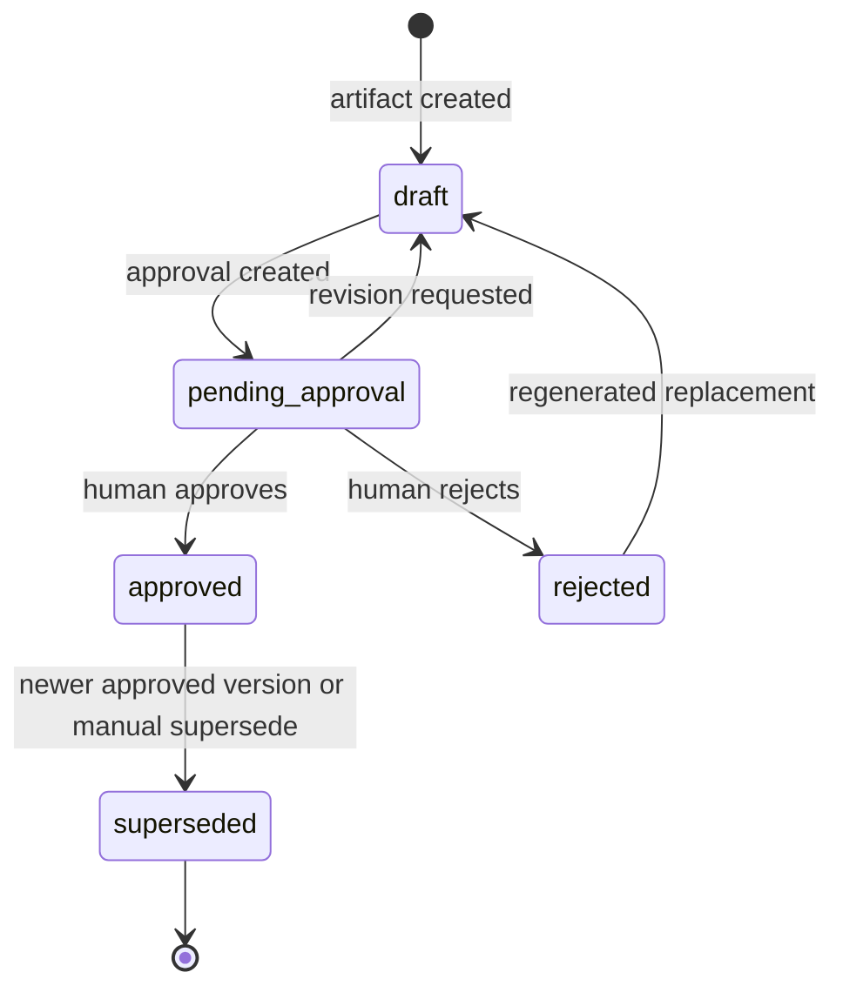
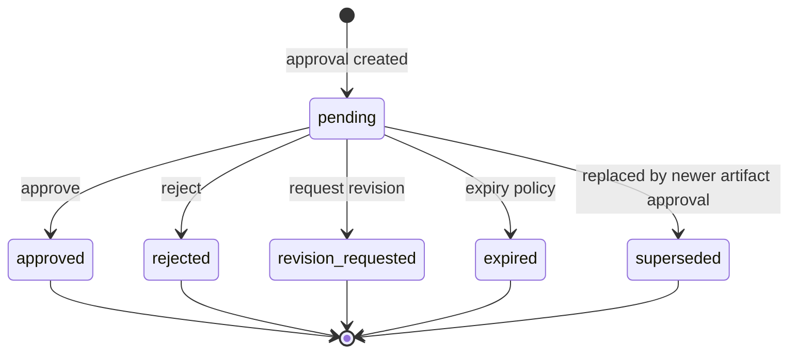
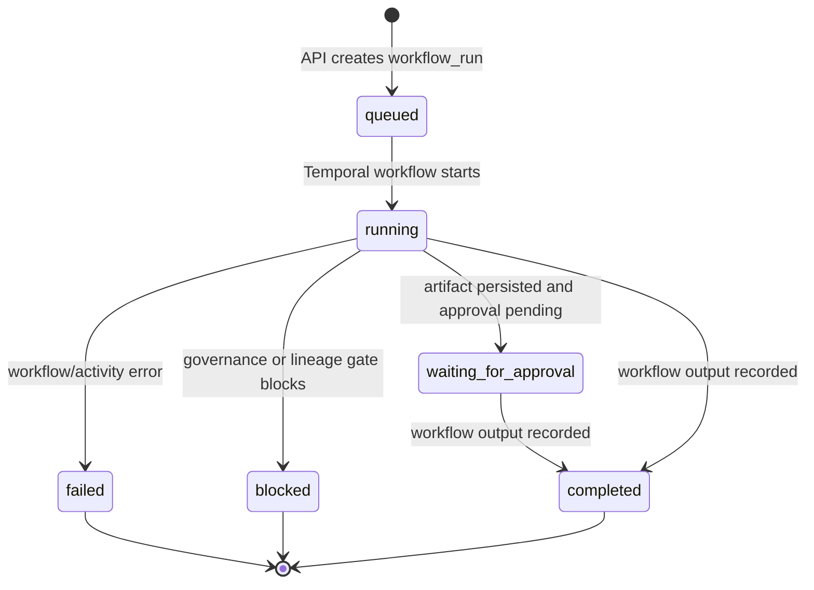
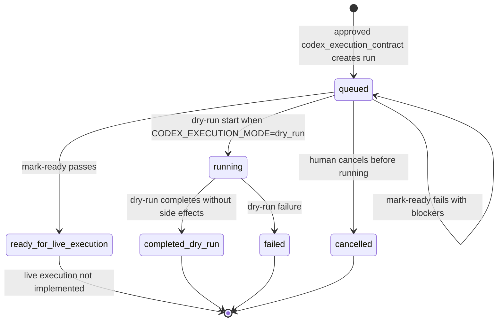
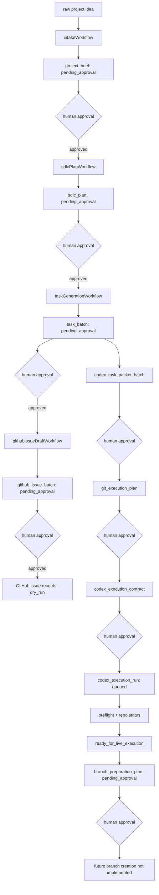
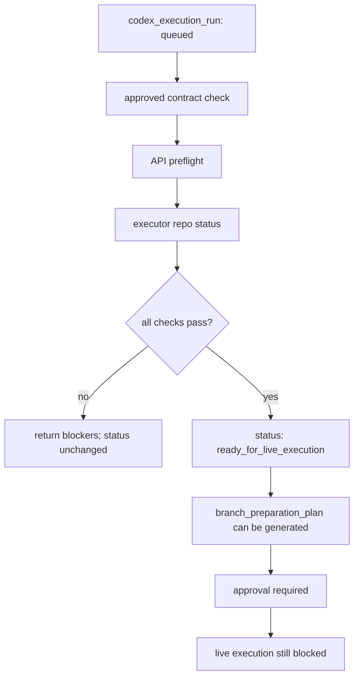
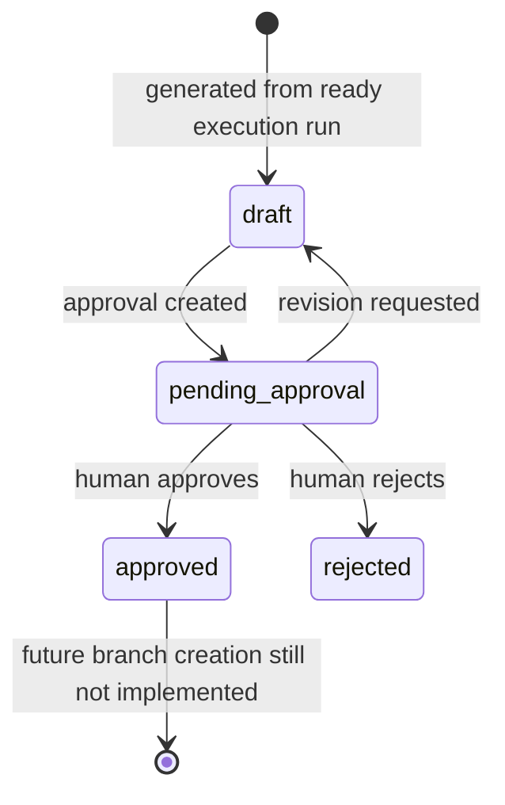

# Revealth v0.1 System State Machine

This document defines the current v0.1 state machines for artifacts, approvals, execution runs, and workflow runs. It is descriptive of the current implementation and should be treated as the stabilization reference before live execution work begins.

## Artifact State Machine

States:

- `draft`
- `pending_approval`
- `approved`
- `rejected`
- `superseded`



Current notes:

- Most governed generators create `draft`, create an approval, then update to `pending_approval`.
- Approval decisions are executed through `ApprovalService`.
- Downstream workflow chaining happens only after selected artifact types become `approved`.
- `superseded` exists in contracts but is not consistently automated.

## Approval State Machine

States:

- `pending`
- `approved`
- `rejected`
- `revision_requested`
- `expired`
- `superseded`



Current notes:

- `approve`, `reject`, and `request-revision` are implemented as routes.
- `expired` and `superseded` are defined states but not fully automated.
- Approval decisions write audit events and update artifact state.
- Stale approval protection exists around artifact version checks.

## Workflow Run State Machine

States:

- `queued`
- `running`
- `waiting_for_approval`
- `completed`
- `failed`
- `blocked`



Current notes:

- Workflows generally mark `running`, persist an artifact, create approval, then mark `completed`.
- `waiting_for_approval` exists in contracts but workflows often complete after creating an approval instead of staying waiting.
- Approval continuation is handled outside Temporal by the API `WorkflowChainService`.
- Failure/blocked handling should be made more explicit before live execution.

## Codex Execution Run State Machine

States:

- `queued`
- `ready_for_live_execution`
- `running`
- `completed_dry_run`
- `failed`
- `cancelled`



Current notes:

- `ready_for_live_execution` is an eligibility state only.
- Live execution remains unimplemented and must remain blocked.
- `start` currently supports dry-run lifecycle and live-mode blocking.
- Cleanup is allowed only for `completed_dry_run`, `failed`, and `cancelled`.
- `ready_for_live_execution` should not imply branch creation, PR creation, or code execution.

## Governed Planning Chain



## Execution Safety Gate



Required checks for `ready_for_live_execution`:

- approved `codex_execution_contract`
- successful preflight
- clean executor worktree
- current branch is not `main` or `master`
- forbidden files are defined
- required tests are defined
- `CODEX_EXECUTION_MODE` is not `disabled`
- live execution remains unimplemented

## Branch Preparation Plan State

`branch_preparation_plan` is an artifact and follows the artifact state machine:



Approval of `branch_preparation_plan` means only:

```text
the future branch creation step has been reviewed
```

It does not mean:

```text
create a branch
execute Codex
modify files
open a pull request
```

## State Machine Gaps To Stabilize

- `waiting_for_approval` is defined but not consistently used as a durable waiting workflow state.
- `expired` and `superseded` approval states need explicit transition policies.
- `superseded` artifact state needs automatic version-aware handling.
- `ready_for_live_execution` should be blocked from `start` until live execution is implemented with a separate executor job model.
- All status transitions should eventually move behind centralized transition functions.
